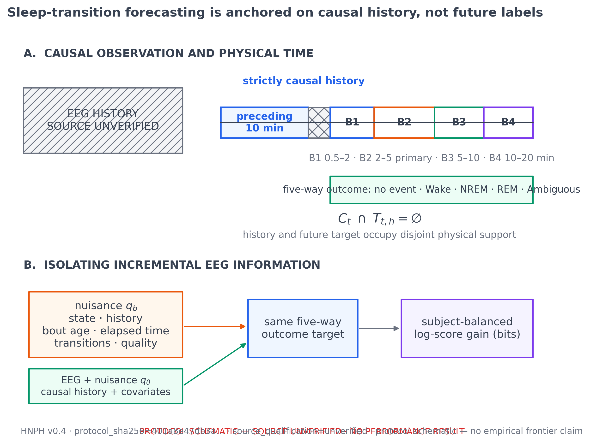
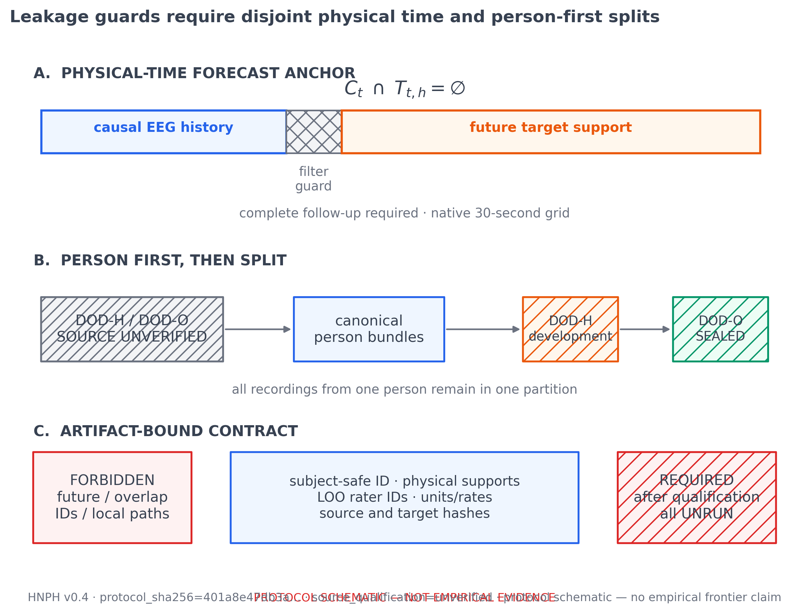
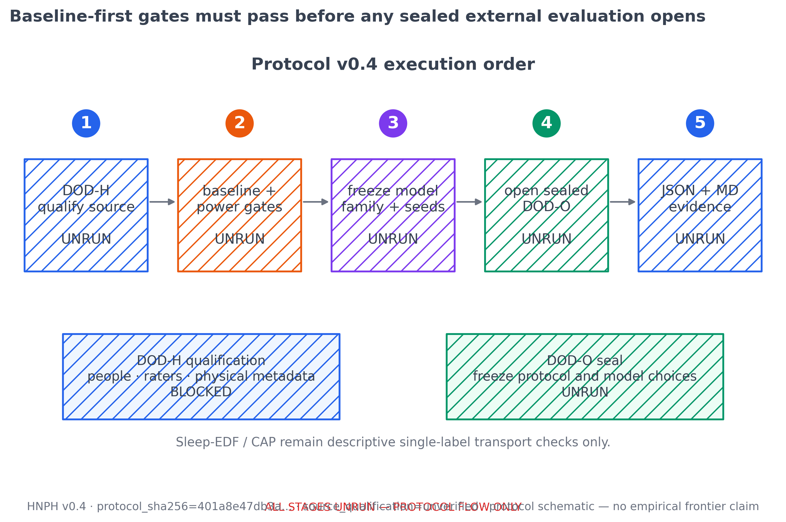
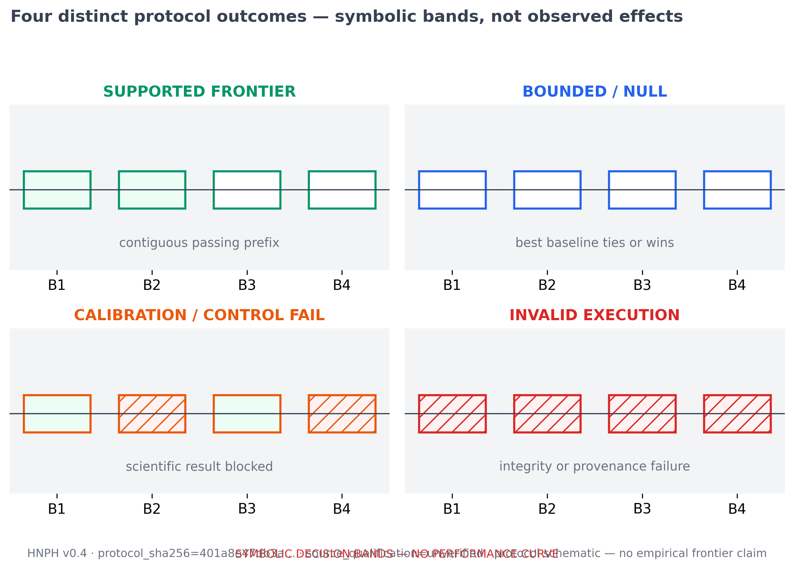
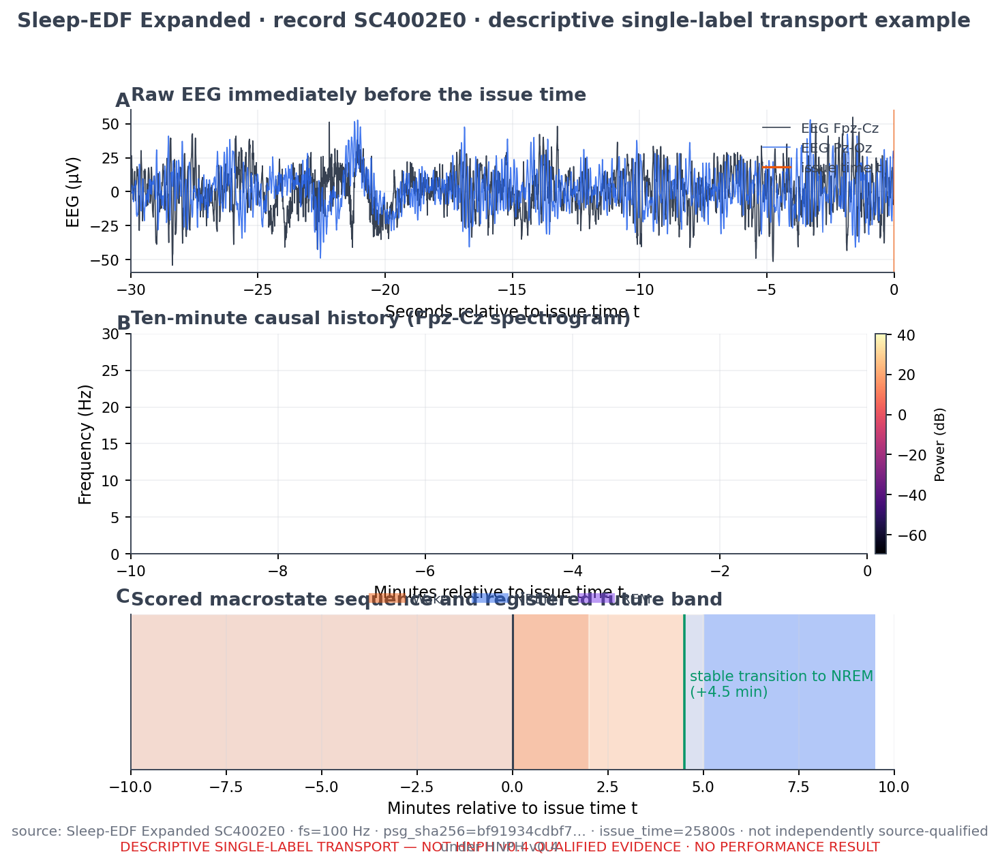
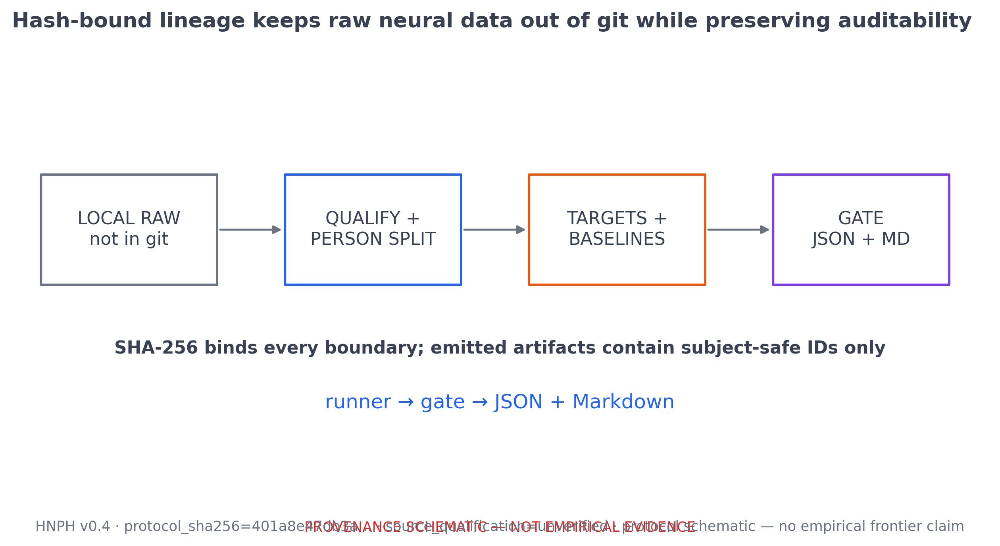
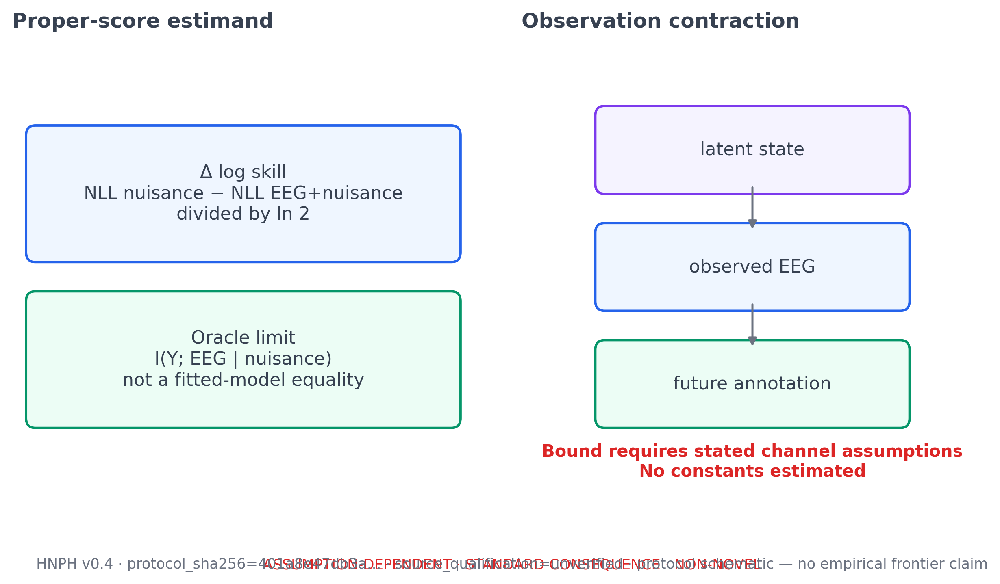

# Kahlus figure archive

Source-controlled index of individual figures for the HNPH protocol preprint. PNG
previews are embedded below; each figure also has a vector PDF export. Figures are
generated from documented scripts, not manually edited.

Regenerate with:

```bash
python3 scripts/analysis/render_docs_figures.py
```

## HNPH v0.4 protocol figures

Protocol schematics and a descriptive single-label transport example. These are
**not** empirical HNPH results. Provenance is in
[`hnph_protocol/FIGURE_PROVENANCE.md`](hnph_protocol/FIGURE_PROVENANCE.md) and
[`hnph_protocol/figure_manifest.json`](hnph_protocol/figure_manifest.json).

| Figure | Classification | Preview |
| --- | --- | --- |
| Operational task | Protocol schematic; no performance result |  |
| Leakage and label contract | Protocol schematic |  |
| Baseline-first study flow | Protocol schematic; stages marked `UNRUN` |  |
| Possible protocol outcomes | Symbolic decision bands only |  |
| Verified example | Descriptive Sleep-EDF transport illustration |  |
| Raw-to-evidence lineage | Provenance schematic |  |
| Score decomposition and ceiling | Assumption-dependent appendix schematic |  |

The complete HNPH preprint build is documented in
[`docs/paper/hnph_preprint/README.md`](../paper/hnph_preprint/README.md).

## BNCI2014_001 ridge diagnostics

The ridge overlap analysis lives in
[`ridge-eeg-diagnostics.md`](ridge-eeg-diagnostics.md), with figures under
`docs/figures/ridge_overlap_headline/` and the summary and interpretation under
`artifacts/ridge_bnci_real/`. That packet is historical benchmark analysis — not
a new Kahlus result and not a clinical claim.
