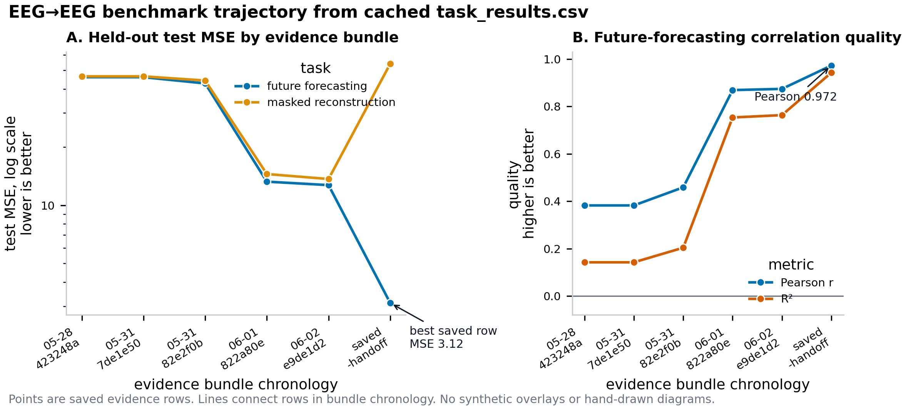
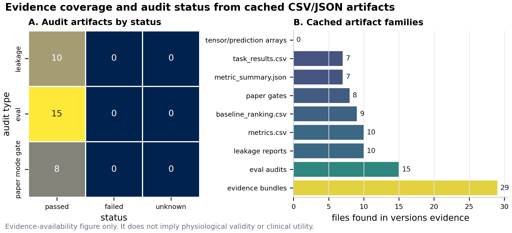
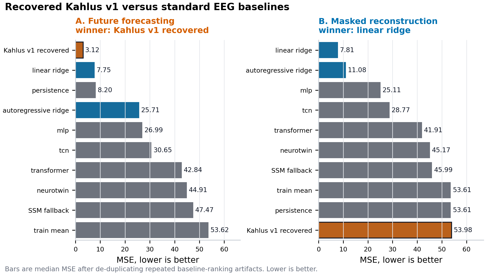
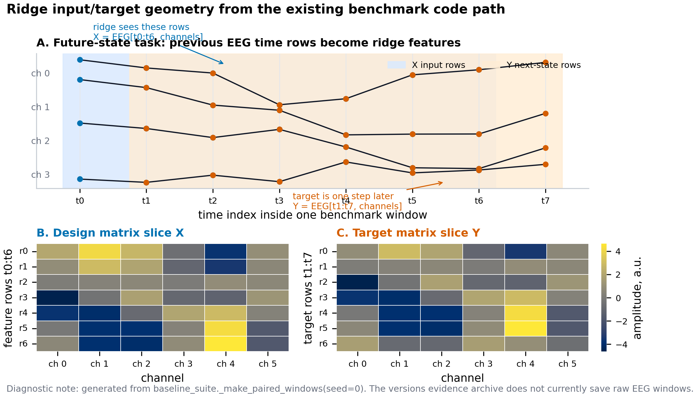
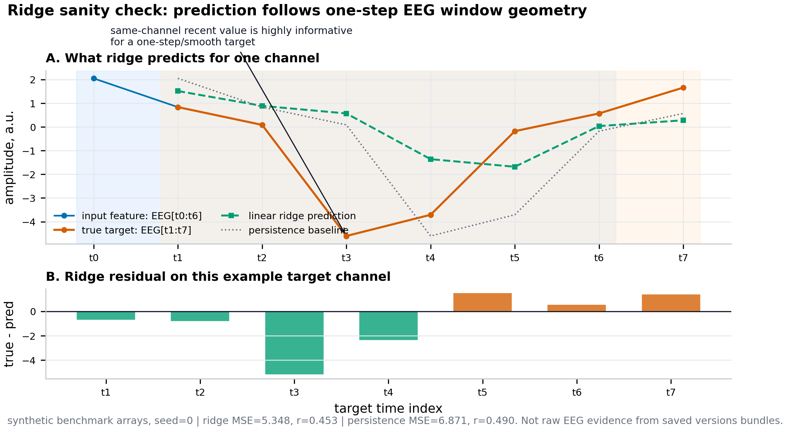
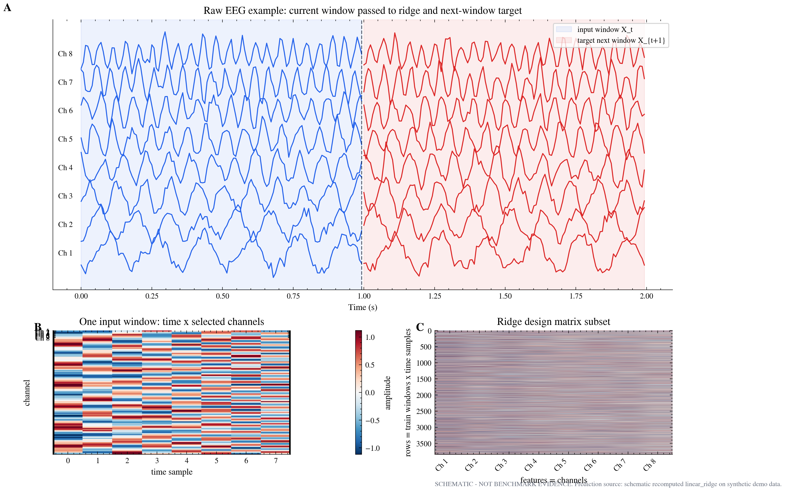
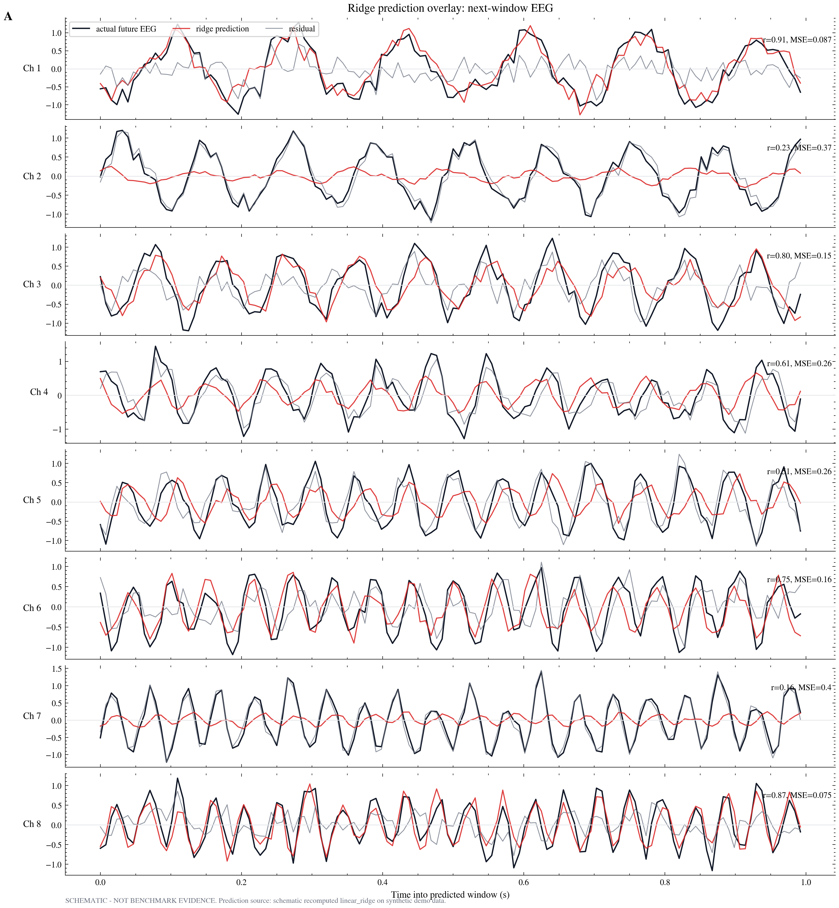
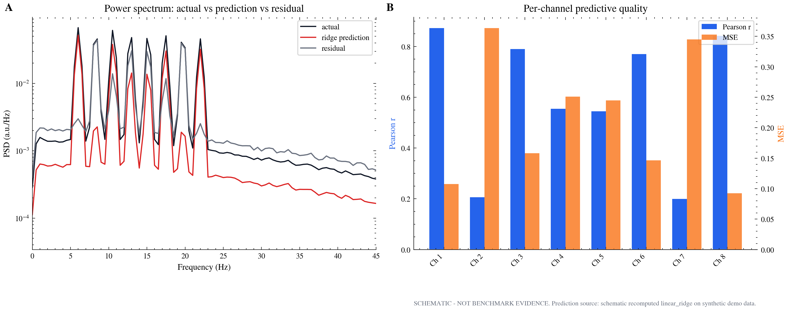

# EEG v1 figure-source packet

<span class="benchmark-badge">BENCHMARK EVIDENCE</span>
<span class="diagnostic-badge">STANDARD MATPLOTLIB/SEABORN FIGURES</span>

This page keeps the CEBRA-style reproducible packet layout: cached result artifacts live in `data/`, figure source scripts live in `src/`, and rendered PNG/PDF/SVG assets live in `figures/`. The public figures now use standard matplotlib/seaborn/tueplots plot types with constrained layout and built-in perceptual colormaps. They do **not** use hand-drawn boxes, arrows, or fixed-coordinate text diagrams.

```{admonition} Bottom line
:class: important
The current versions archive contains saved CSV/JSON evidence, not raw EEG tensors or saved prediction arrays. Therefore the public figures show benchmark metrics, baseline rankings, audit gates, and artifact inventory only. Waveform/residual figures remain schematic until real prediction arrays exist.
```

## Reproducible figure-source layout

Generated by:

```bash
PYTHONPATH=src python scripts/render_eeg_v1_ridge_visuals.py \
  --versions-root /Users/aayu/Downloads/versions \
  --out-dir docs/research/eeg_v1_ridge_visuals
```

The generated packet is here:

```{toctree}
:hidden:
:maxdepth: 1

Figure source packet <../research/eeg_v1_figure_source/README>
```

```text
docs/research/eeg_v1_figure_source/
├── data/
│   ├── task_results.csv
│   ├── baseline_ranking.csv
│   ├── audits.csv
│   ├── inventory.json
│   └── provenance.json
├── src/
│   ├── _figure_style.py
│   ├── Figure1_eeg_v1_benchmark_overview.py
│   ├── Figure2_eeg_v1_audit_matrix.py
│   └── Figure3_eeg_v1_baseline_ranking.py
└── figures/
    ├── Figure1_eeg_v1_benchmark_overview.{png,pdf,svg}
    ├── Figure2_eeg_v1_audit_matrix.{png,pdf,svg}
    └── Figure3_eeg_v1_baseline_ranking.{png,pdf,svg}
```

## Paper-style evidence figures

<div class="figure-card">



**Figure 1. EEG v1 benchmark trajectory.** Standard matplotlib/seaborn/tueplots-style line plots rendered from `task_results.csv`. The figure shows how held-out EEG→EEG test MSE and future-forecasting Pearson/R² changed across saved evidence bundles, with the best saved MSE row annotated. Source: [`src/Figure1_eeg_v1_benchmark_overview.py`](../research/eeg_v1_figure_source/src/Figure1_eeg_v1_benchmark_overview.py). Data: [`task_results.csv`](../research/eeg_v1_figure_source/data/task_results.csv). [PDF](../research/eeg_v1_figure_source/figures/Figure1_eeg_v1_benchmark_overview.pdf) · [SVG](../research/eeg_v1_figure_source/figures/Figure1_eeg_v1_benchmark_overview.svg)

</div>

<div class="figure-card">



**Figure 2. Audit and artifact coverage.** Standard matplotlib/seaborn stacked bars and horizontal counts rendered from `audits.csv` and `inventory.json`. The figure summarizes audit pass/fail/unknown counts and makes the key evidence limitation visible: cached tensor/prediction arrays are absent, so waveform overlays stay out of the public evidence figures. Source: [`src/Figure2_eeg_v1_audit_matrix.py`](../research/eeg_v1_figure_source/src/Figure2_eeg_v1_audit_matrix.py). Data: [`audits.csv`](../research/eeg_v1_figure_source/data/audits.csv), [`inventory.json`](../research/eeg_v1_figure_source/data/inventory.json). [PDF](../research/eeg_v1_figure_source/figures/Figure2_eeg_v1_audit_matrix.pdf) · [SVG](../research/eeg_v1_figure_source/figures/Figure2_eeg_v1_audit_matrix.svg)

</div>

<div class="figure-card">



**Figure 3. Recovered Kahlus v1 versus standard baselines.** Standard horizontal matplotlib/seaborn bar plots rendered by joining recovered Kahlus rows from `task_results.csv` with baseline rows from `baseline_ranking.csv`. This makes the honest story visible: recovered Kahlus v1 beats linear ridge on EEG future forecasting, while ridge remains stronger on masked reconstruction. Source: [`src/Figure3_eeg_v1_baseline_ranking.py`](../research/eeg_v1_figure_source/src/Figure3_eeg_v1_baseline_ranking.py). Data: [`task_results.csv`](../research/eeg_v1_figure_source/data/task_results.csv), [`baseline_ranking.csv`](../research/eeg_v1_figure_source/data/baseline_ranking.csv). [PDF](../research/eeg_v1_figure_source/figures/Figure3_eeg_v1_baseline_ranking.pdf) · [SVG](../research/eeg_v1_figure_source/figures/Figure3_eeg_v1_baseline_ranking.svg)

</div>

## Ridge sanity-check diagrams

```{admonition} Answering Amrith's question without adding benchmarks
:class: warning
These diagrams visualize the **existing future-state ridge benchmark contract**: what enters ridge regression and what it predicts. The saved versions evidence archive still does **not** contain raw EEG windows or saved prediction arrays, so these are benchmark-contract diagnostics generated from the in-repo benchmark code path, not raw EEG evidence figures.
```

<div class="figure-card">



**Figure S6. What goes into ridge regression.** The future-state task pairs each benchmark window as `X = EEG[t0:t6, channels]` and `Y = EEG[t1:t7, channels]`. Ridge fits the flattened design matrix to the flattened one-step-later target matrix. Source: [`src/render_ridge_waveform_sanity.py`](../research/eeg_v1_ridge_sanity_diagrams/src/render_ridge_waveform_sanity.py). Summary: [`ridge_waveform_sanity_summary.json`](../research/eeg_v1_ridge_sanity_diagrams/data/ridge_waveform_sanity_summary.json). [PDF](../research/eeg_v1_ridge_sanity_diagrams/figures/FigureS6_ridge_future_window_contract.pdf) · [SVG](../research/eeg_v1_ridge_sanity_diagrams/figures/FigureS6_ridge_future_window_contract.svg)

</div>

<div class="figure-card">



**Figure S7. What ridge predicts.** One target channel is shown with the input trace, one-step-later target, linear ridge prediction, persistence baseline, and ridge residual. The main sanity-check point is visible: short-horizon smooth signals make recent same-channel values highly informative, so ridge can perform well for a narrow autocorrelation reason. [PDF](../research/eeg_v1_ridge_sanity_diagrams/figures/FigureS7_ridge_prediction_overlay.pdf) · [SVG](../research/eeg_v1_ridge_sanity_diagrams/figures/FigureS7_ridge_prediction_overlay.svg)

</div>

```{toctree}
:hidden:
:maxdepth: 1

Ridge waveform sanity packet <../research/eeg_v1_ridge_sanity_diagrams/README>
```

## What still cannot be claimed

- **Allowed:** “The versions archive contains EEG→EEG task metrics, baseline rankings, leakage audits, eval audits, and paper-mode gates.”
- **Allowed:** “The public figures are generated from cached CSV/JSON artifacts, with source scripts checked into the docs tree.”
- **Allowed:** “Linear ridge ranks best on saved masked-reconstruction baseline rows, but recovered Kahlus v1 beats ridge on the saved EEG future-forecasting comparison.”
- **Not allowed:** “The current waveform overlay proves a biological signal forecast.” No real `prediction_examples.npz` exists yet.
- **Not allowed:** “These figures show clinical EEG physiology.” No raw EEG tensors, montage metadata, or physiological units are present in the versions evidence bundles.

## Restored schematic diagnostic packet

```{admonition} Why these remain below the evidence figures
:class: note
These older ridge EEG figures from `/Users/aayu/Workspace/developer/Kahlus-V1/docs/analysis/ridge_eeg_figures` are still useful as visual targets. Their own README marks them as **schematic demo figures, not benchmark evidence**, so they stay below the public evidence packet.
```

<div class="figure-card">



**Figure S1. Schematic input/target waveforms and design matrix.** Explanatory schematic output, not benchmark evidence. [PDF](../research/ridge_eeg_diagnostic_schematics/fig1_ridge_input_target_waveforms.pdf)

</div>

<div class="figure-card">



**Figure S2. Schematic ridge prediction overlay.** This is the target visual style once real prediction arrays are exported. [PDF](../research/ridge_eeg_diagnostic_schematics/fig2_ridge_prediction_overlay.pdf)

</div>

<div class="figure-card">


**Figure S3. Schematic autocorrelation lag structure.** Shows the diagnostic structure needed before interpreting short-horizon ridge wins. [PDF](../research/ridge_eeg_diagnostic_schematics/fig3_autocorrelation_lag_structure.pdf)

</div>

<div class="figure-card">


**Figure S4. Schematic ridge coefficient channel map.** Useful for explaining the channel-to-channel ridge map contract. [PDF](../research/ridge_eeg_diagnostic_schematics/fig4_ridge_coefficient_channel_map.pdf)

</div>

<div class="figure-card">



**Figure S5. Schematic PSD and residual diagnostics.** This becomes public evidence only after raw tensors and saved predictions are exported with units and channel labels. [PDF](../research/ridge_eeg_diagnostic_schematics/fig5_psd_residual_diagnostics.pdf)

</div>

For exact counts, medians, and generated artifact provenance, see [the generated analysis page](../research/eeg_v1_ridge_visuals/eeg_v1_ridge_visual_analysis.md). The figure-source packet README is available at [eeg_v1_figure_source/README.md](../research/eeg_v1_figure_source/README.md).
