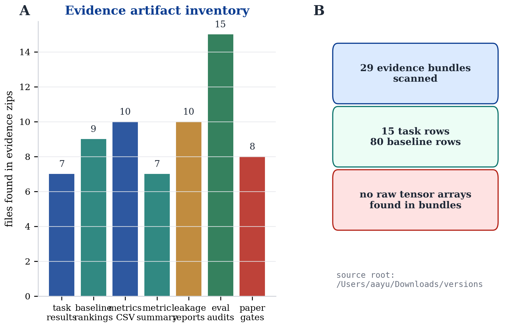
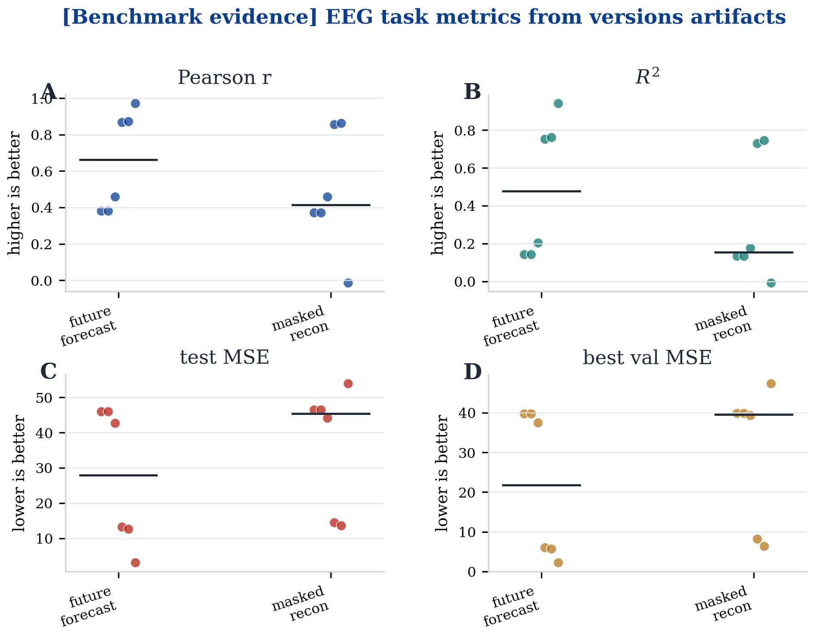
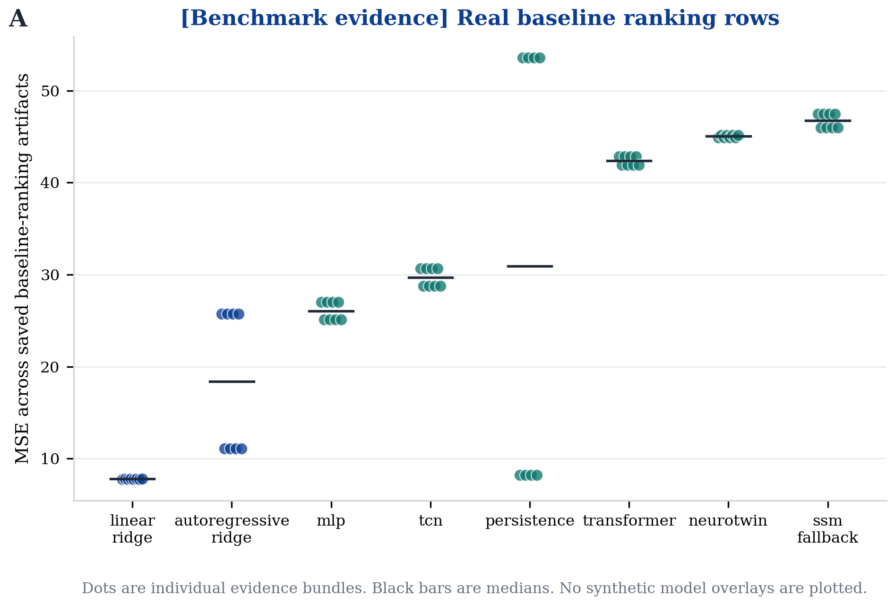
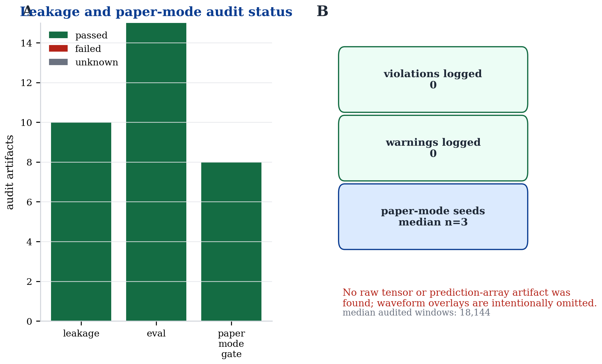

# EEG/ridge evidence figures from versions

<span class="benchmark-badge">BENCHMARK EVIDENCE</span>
<span class="diagnostic-badge">ARTIFACT AUDIT</span>

This page summarizes the EEG/ridge evidence that is actually saved in `/Users/aayu/Downloads/versions`. It is written for the data-scientist review loop: first inventory the artifacts, then plot the real CSV/JSON measurements, then state what is missing.

```{admonition} Bottom line
:class: important
The previous synthetic waveform and prediction-overlay figures have been removed. The versions bundles currently contain task metrics, baseline rankings, leakage reports, eval audits, and paper-mode gates. They do **not** contain raw tensors, saved epochs, or prediction arrays, so this page does not render trace overlays.
```

## Generated visual packet

Generated by:

```bash
PYTHONPATH=src python3 scripts/render_eeg_v1_ridge_visuals.py \
  --versions-root /Users/aayu/Downloads/versions \
  --out-dir docs/research/eeg_v1_ridge_visuals
```

Every plotted dot/bar below comes from saved evidence artifacts such as `task_results.csv`, `baseline_ranking.csv`, `leakage_report.json`, `eval_audit.json`, and `paper_mode_gate.json` inside the archived evidence zips.

<div class="figure-card">



**Figure 1. Evidence inventory.** Counts the actual artifact classes found in the versions evidence zips and explicitly marks whether raw tensor or prediction-array artifacts exist. [PDF](../research/eeg_v1_ridge_visuals/fig01_versions_evidence_inventory.pdf)

</div>

<div class="figure-card">



**Figure 2. EEG task metrics from saved artifacts.** Strip plots of EEG→EEG task measurements parsed from `task_results.csv`: Pearson correlation, $R^2$, test MSE, and best validation MSE. Dots are individual evidence bundles. [PDF](../research/eeg_v1_ridge_visuals/fig02_eeg_task_metrics_from_versions.pdf)

</div>

<div class="figure-card">



**Figure 3. Real baseline ranking rows.** MSE values parsed from non-empty `baseline_ranking.csv` artifacts. This replaces the old synthetic prediction overlay because no saved prediction arrays exist in the versions bundle. [PDF](../research/eeg_v1_ridge_visuals/fig03_real_baseline_ranking.pdf)

</div>

<div class="figure-card">



**Figure 4. Leakage and paper-mode audit status.** Parsed status for leakage reports, eval audits, and paper-mode gates, with total violations/warnings and seed coverage where available. [PDF](../research/eeg_v1_ridge_visuals/fig04_leakage_and_gate_audit.pdf)

</div>

## Interpretation

This page is evidence-led rather than screenshot-led. A good scientific docs page should say “we have these artifacts, here is what they show, and here is what they cannot show yet.” Right now, the evidence supports metrics and audit plots. It does not support raw EEG waveform overlays or per-window prediction examples.

## Evidence boundary

- **Allowed:** “The versions archive contains EEG→EEG task metrics, baseline rankings, leakage audits, and paper-mode gates.”
- **Allowed:** “The current public figures are generated from saved CSV/JSON evidence artifacts.”
- **Not allowed:** “The prediction overlay proves ridge understands brain state.” No prediction arrays are saved.
- **Not allowed:** “These figures show clinical EEG physiology.” No raw EEG tensors or electrode metadata are present in the scanned evidence zips.

For exact counts, medians, and generated artifact provenance, see [the generated analysis page](../research/eeg_v1_ridge_visuals/eeg_v1_ridge_visual_analysis.md).
