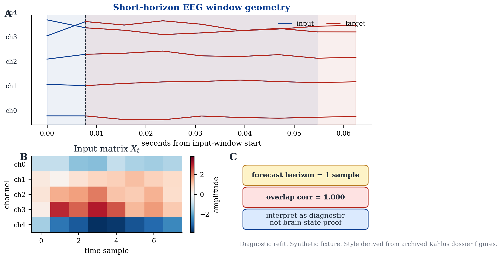
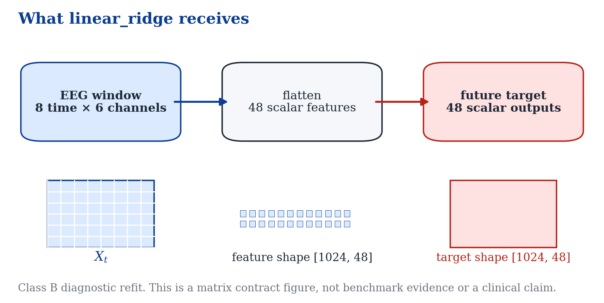
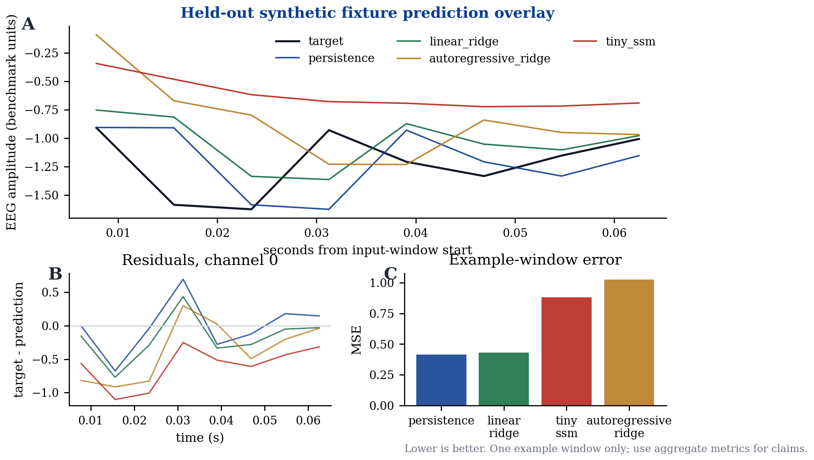
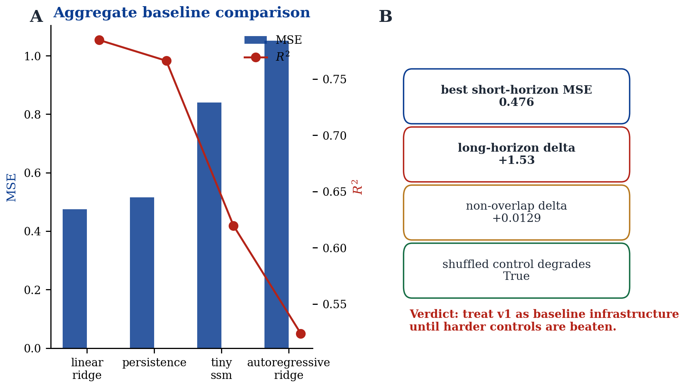

# EEG v1 ridge visual sanity check

<span class="diagnostic-badge">DIAGNOSTIC REFIT</span>
<span class="schematic-badge">SYNTHETIC FIXTURE</span>

This page explains the current EEG v1 future-window ridge result. It is meant for Amrith-style review: fast, technical, honest, and visually grounded.

```{admonition} Bottom line
:class: important
This is not a new benchmark. It visualizes the existing EEG v1 future-window benchmark so the ridge result is easier to inspect. Strong ridge performance here is plausibly explained by local temporal structure and short-horizon overlap.
```

## Publication-style visual packet

Generated by:

```bash
PYTHONPATH=src python3 scripts/render_eeg_v1_ridge_visuals.py \
  --dataset synthetic_fixture \
  --out-dir docs/research/eeg_v1_ridge_visuals
```

The figure style is derived from the archived Kahlus dossier visual system in `/Users/aayu/Downloads/versions`, but the plotted numbers and traces come from the current repository's synthetic EEG v1 benchmark fixture.

<div class="figure-card">



**Figure 1. Window overlap diagnostic.** Current input window, future target window, input heatmap, and overlap warning. The forecast horizon is short, so overlap and autocorrelation must be treated as primary explanations. [PDF](../research/eeg_v1_ridge_visuals/fig01_eeg_window_overlap_diagnostic.pdf)

</div>

<div class="figure-card">



**Figure 2. Ridge design-matrix contract.** Shows what `linear_ridge` receives in the current EEG v1 task: the raw EEG window flattened into scalar time-channel features, then mapped to the future-window target. [PDF](../research/eeg_v1_ridge_visuals/fig02_ridge_design_matrix_contract.pdf)

</div>

<div class="figure-card">



**Figure 3. Prediction overlay and residuals.** One held-out synthetic fixture window with persistence, ridge, autoregressive ridge, and TinySSM overlays, plus residuals and example-window MSE. This is a diagnostic sanity check, not public EEG evidence. [PDF](../research/eeg_v1_ridge_visuals/fig03_prediction_overlay_and_residuals.pdf)

</div>

<div class="figure-card">



**Figure 4. Baseline and autocorrelation controls.** Aggregate model metrics and the existing autocorrelation-control summary. The verdict is caution: treat v1 as baseline infrastructure until harder controls are beaten. [PDF](../research/eeg_v1_ridge_visuals/fig04_baseline_and_autocorrelation_controls.pdf)

</div>

## Interpretation

The committed synthetic fixture reports same-record shifted overlap correlation near `1.0`. That means the target can be extremely similar to the input shifted by one sample. A model can do well by tracking continuity rather than discovering a new latent neural field.

## Evidence boundary

- **Allowed:** “The visual packet explains why ridge can look strong on the current synthetic EEG v1 task.”
- **Not allowed:** “Kahlus understands brain state.”
- **Not allowed:** “This result predicts seizures or clinical outcomes.”
- **Not allowed:** “TinySSM/NeuroTwin is validated by this synthetic result.”

For exact metrics and generated artifact provenance, see [the generated analysis page](../research/eeg_v1_ridge_visuals/eeg_v1_ridge_visual_analysis.md).
