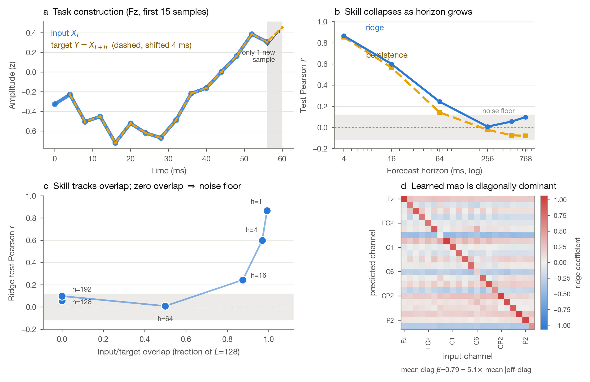

# Ridge EEG diagnostics for Amrith

Amrith asked for visualization and analysis of the **existing benchmark**, not additional benchmarks. The goal is to make the ridge baseline interpretable:

> What EEG goes into ridge regression, what is predicted, and why can a simple linear model perform well?

```{admonition} Critical correction
:class: warning
The current repo baseline `linear_ridge` fits `NumpyRidgeBaseline(alpha=1e-2)` after reshaping `[windows, time, channels]` into `[windows*time, channels]`. It is therefore a regularized channel-to-channel linear map applied across stacked timepoints, not a giant flattened whole-window model.
```

## The result

On BNCI2014_001 (BCI Competition IV-2a, 22 EEG channels, 250 Hz, local MOABB cache; subject-held-out split train=[1..6] test=[7..9], per-subject z-scoring), the headline ridge number at the historical `horizon=1` setting is **r=0.87**. That number is a task-construction artifact, not evidence of learned neural dynamics: at `h=1` the forecast target is the input window shifted by a single 4 ms sample, so 127 of 128 samples are bit-identical between input and target.

<div class="figure-card">



**Figure. The ridge headline on BNCI2014_001 measures input/target overlap, not neural forecasting.** **(a)** Task construction: the target trace (dashed) is drawn directly on the input trace (solid), offset by `h=1` sample (4 ms) — visibly the same signal, not asserted in prose. **(b)** Test Pearson r for ridge and a matched persistence baseline both collapse toward the noise floor as horizon `h` grows; ridge never separates far from persistence. **(c)** The central result: skill plotted directly against input/target overlap fraction (one axis, not `h`) shows skill tracking overlap monotonically down to the noise floor. Once the target no longer overlaps the input (`h >= L = 128`), ridge sits at r ~ 0.06-0.10, within the noise floor. **(d)** The fitted 22x22 ridge coefficient map is **diagonally dominant, not an identity**: mean diagonal beta = 0.79, which is 5.1x the mean |off-diagonal| entry, but `||C-I||_F / ||I||_F = 0.94` — 80% of the coefficient mass is off-diagonal. The strong diagonal explains why ridge tracks persistence; the off-diagonal mass is the small, real, not-yet-characterized cross-channel term by which ridge exceeds persistence at short horizons.

</div>

**PDF (vector, for slides/papers):** [`fig_ridge_overlap_headline.pdf`](ridge_overlap_headline/fig_ridge_overlap_headline.pdf) · **LaTeX caption:** `artifacts/ridge_bnci_real/figures/fig_ridge_overlap_headline_caption.tex`

## Full horizon sweep

| horizon | overlap | ridge Pearson r | ridge R^2 | persistence r |
|--------:|--------:|----------------:|----------:|--------------:|
| 1 (4 ms)    | 0.99 | **0.866** | 0.749 | 0.852 |
| 4 (16 ms)   | 0.97 | 0.599 | 0.358 | 0.565 |
| 16 (64 ms)  | 0.88 | 0.243 | 0.051 | 0.142 |
| 64 (256 ms) | 0.50 | 0.008 | -0.005 | -0.022 |
| 128 (512 ms)| 0.00 | 0.056 | 0.002 | -0.074 |
| 192 (768 ms)| 0.00 | 0.098 | 0.009 | -0.079 |

The honest benchmark is the non-overlapping horizon (`h >= L`), where every current baseline is at the noise floor. That is the bar any real model has to clear.

## Takeaway for Amrith

The strong ridge number is a **task-construction artifact of overlapping input/target windows**, not evidence of a rich neural-state model. The fitted map is diagonally dominant (mean diag beta=0.79) rather than an identity (`||C-I||_F/||I||_F=0.94`): the diagonal explains the persistence-level skill, and the real but small off-diagonal mass is why ridge sits a few points above matched persistence at short horizons — a cross-channel effect that is real but not yet characterized further.

## Reproduce

```bash
PYTHONPATH=src python3 scripts/analysis/build_bnci_ridge_tensors.py
PYTHONPATH=src python3 scripts/analysis/plot_ridge_paper_figure.py \
  --npz artifacts/ridge_bnci_real/ridge_bnci_tensors.npz \
  --summary artifacts/ridge_bnci_real/ridge_bnci_summary.json \
  --out artifacts/ridge_bnci_real/figures
```

`build_bnci_ridge_tensors.py` reads directly from the local MOABB cache (BNCI2014_001) and refits the repo's own `NumpyRidgeBaseline`; nothing here depends on prompted or schematic data. The 99 MB intermediate tensor file is not committed — it regenerates deterministically from the cache in the command above. `ridge_bnci_summary.json` carries the numeric results and is committed for provenance.

See [visual standards](visual-standards.md) for the figure rule this page follows (category 1: benchmark-derived evidence, generated from stored tensors with source/split/model/metrics).

## Earlier schematic prototype

Before real benchmark tensors were available, a layout-only prototype packet was generated from synthetic demo data to work out figure grammar. It is archived at [Ridge EEG diagnostic figures (schematic prototype, superseded)](../analysis/ridge_eeg_figures/README.md) and is not benchmark evidence.
