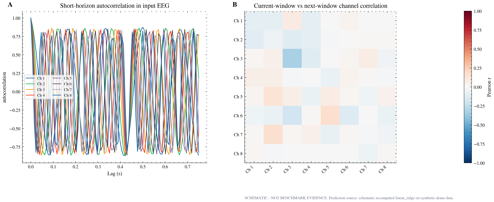
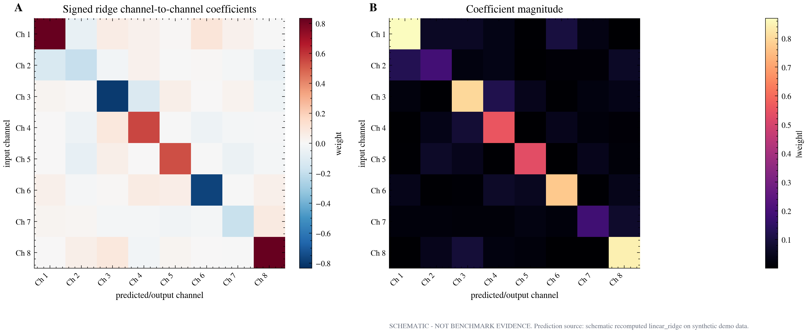

# Ridge EEG diagnostics for Amrith

<span class="schematic-badge">CURRENT FIGURES ARE SCHEMATIC</span>

Amrith asked for visualization and analysis of the **existing benchmark**, not additional benchmarks. The immediate goal is to make the ridge baseline interpretable:

> What EEG goes into ridge regression, what is predicted, and why can a simple linear model perform well?

```{admonition} Critical correction
:class: warning
The current repo baseline `linear_ridge` fits `NumpyRidgeBaseline(alpha=1e-2)` after reshaping `[windows, time, channels]` into `[windows*time, channels]`. It is therefore a regularized channel-to-channel linear map applied across stacked timepoints, not a giant flattened whole-window model.
```

## What Amrith should see first

1. The current EEG window and next-window target, with real channel labels and time units.
2. The design matrix actually passed to ridge: rows are `window x time`, columns are channels/features.
3. Actual vs predicted future EEG, plus residuals and per-channel metrics.
4. Autocorrelation and current-vs-next-window correlation, to test whether ridge is exploiting temporal continuity.
5. Ridge coefficient maps, to show whether the model mostly uses diagonal/same-channel structure or broad channel mixing.
6. Optional topomaps only if real montage/channel positions exist.

## Current schematic figure packet

These figures are layout prototypes generated by:

```bash
python3 scripts/analysis/plot_ridge_eeg_diagnostics.py
```

They are useful for visual grammar, but **not evidence** until rerun with real benchmark tensors.

<div class="figure-card">


**Figure 1. EEG input/target layout.** Current window, next-window target, and the ridge design-matrix subset. In the real version, this must use actual channel names, sampling rate, split, and benchmark source.

</div>

<div class="figure-card">


**Figure 2. Prediction overlay.** Actual future EEG, ridge prediction, and residuals. This is the main sanity-check figure for whether ridge tracks physiologically meaningful dynamics or mostly smooth continuity.

</div>

<div class="figure-card">



**Figure 3. Autocorrelation and lag structure.** If autocorrelation is strong over the forecast horizon, ridge can perform well without implying a rich neural-state model.

</div>

<div class="figure-card">



**Figure 4. Ridge coefficient map.** Shows signed and absolute channel-to-channel coefficients. A diagonal-heavy map would support a persistence/covariance explanation.

</div>

<div class="figure-card">


**Figure 5. Spectral and residual diagnostics.** Compares actual, predicted, and residual power spectra, plus per-channel prediction quality.

</div>

## Real-data contract

To convert these from schematic figures to benchmark-derived figures, create an `.npz` with:

- `x_train`: `[n_train_windows, time, channels]`
- `y_train`: `[n_train_windows, time, channels]`
- `x_test`: `[n_test_windows, time, channels]`
- `y_test`: `[n_test_windows, time, channels]`
- optional `y_pred_test`: benchmark/exported ridge prediction
- optional `sfreq`: sampling frequency
- optional `channel_names`: EEG channel names
- optional provenance fields: `dataset`, `task_id`, `split_manifest`, `event_manifest`, `commit`, `run_label`

Then run:

```bash
python3 scripts/analysis/plot_ridge_eeg_diagnostics.py \
  --npz path/to/ridge_eeg_tensors.npz
```

If the arrays are flattened, add:

```bash
  --time-length 128 \
  --n-channels <N>
```

## Suggested mentor-facing interpretation

A conservative caption should say:

> The ridge baseline is analyzed as a regularized linear channel-to-channel map over stacked timepoints for the current EEG future-state task. These diagnostics test whether ridge performance reflects short-horizon temporal autocorrelation and stable channel covariance, rather than evidence of a complex latent neural field model.

That framing is careful, honest, and exactly the kind of thing a mentor can trust.
