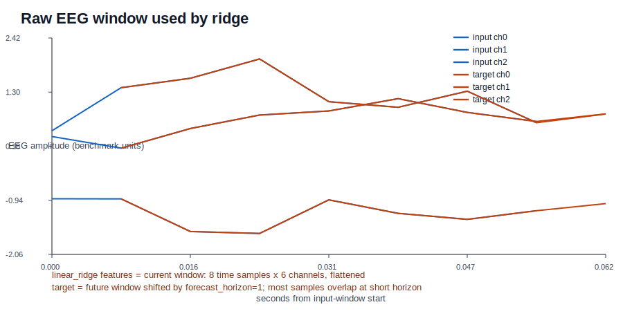
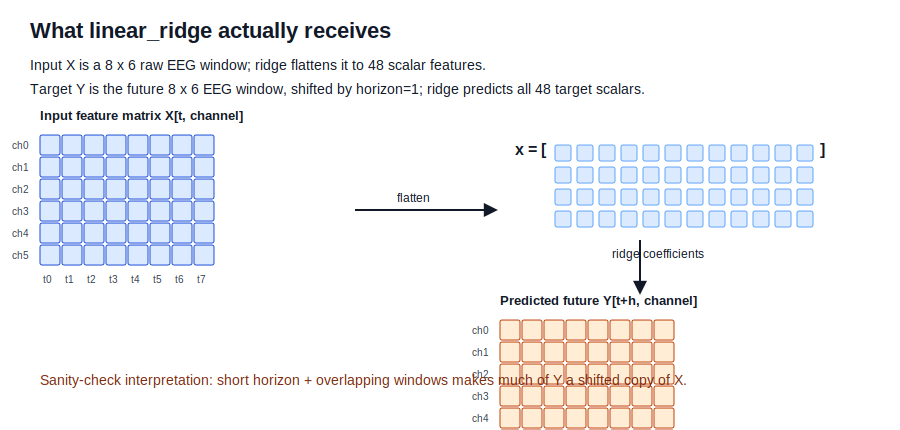
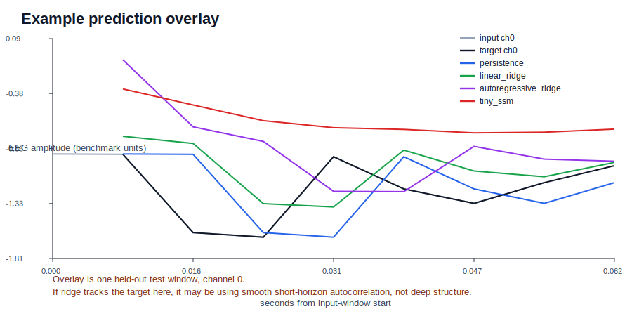

# EEG v1 Ridge Baseline Visual Sanity Check

This is not a new benchmark. It visualizes the existing EEG v1 future-window benchmark so the ridge result is easier to inspect.

- dataset: `synthetic_eeg_v1`
- source: `synthetic_fixture`
- benchmark_status: `synthetic_fixture_not_public_benchmark`
- window_length: `8`
- forecast_horizon: `1`
- ridge feature matrix: `[1024, 48]` after flattening input windows
- ridge target matrix: `[1024, 48]` after flattening future windows
- same-record shifted overlap correlation for the plotted test window: `0.9999999999999998`

## Diagrams

## Current Benchmark Metrics

| model | mse | mae | r2 | pearsonr |
|---|---:|---:|---:|---:|
| linear_ridge | 0.475509 | 0.513796 | 0.78466 | 0.885988 |
| persistence | 0.516311 | 0.539455 | 0.766182 | 0.883697 |
| tiny_ssm | 0.839992 | 0.702251 | 0.619599 | 0.788796 |
| autoregressive_ridge | 1.05154 | 0.763142 | 0.523797 | 0.724083 |

## Why Ridge Can Look Strong Here

- `linear_ridge` sees the entire raw EEG input window flattened into scalar time-channel features.
- The target is the future EEG window, not a distant label. With `forecast_horizon=1`, most of the target window is the input window shifted by one sample.
- The synthetic fixture is deliberately smooth/autoregressive, so a linear model is well matched to the data-generating structure.
- Strong ridge or persistence performance is therefore a sanity-check signal for autocorrelation, short horizon, and overlap; it is not evidence of brain-state understanding.

## Existing Autocorrelation Controls

- verdict: `treat_v1_as_baseline_infrastructure_until_harder_controls_are_beaten`
- persistence_or_ridge_dominates: `True`
- short_horizon_best_mse: `0.4755090613404005`
- long_horizon_delta_vs_short: `1.5335808588401618`
- non_overlap_delta_vs_short: `0.012912323382852697`
- shuffled_target_close_to_real_baselines: `False`

Bottom line: this analysis supports caution. The existing result is plausibly explained by local temporal structure and benchmark geometry, so adding more benchmarks would be noisier than first understanding this one.
