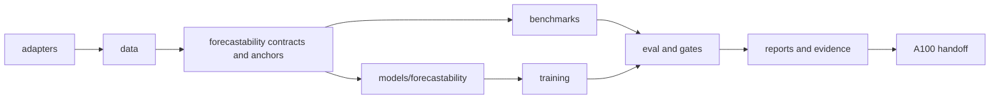
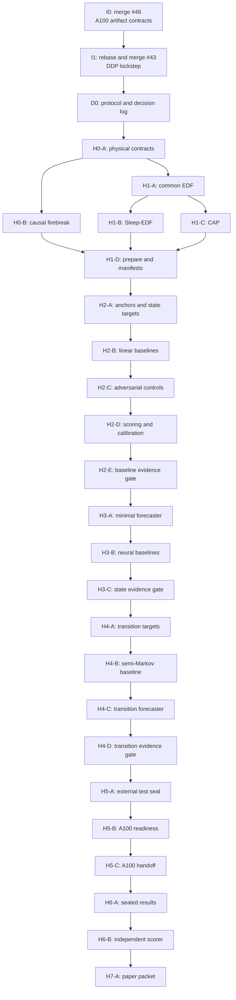

# Kahlus HNPH Delivery Plan: PR Architecture and Merge Protocol

**Status:** Planning only. No HNPH/KSTF implementation or result is implied by this document.
**Date:** 2026-07-09
**Companion specification:** `docs/research/kahlus_hnph_full_development_protocol.md`
**Program baseline:** `origin/main`, not the current long-lived ResearchDock branch.

## 1. Delivery Decision

HNPH/KSTF will be delivered as a sequence of small, independently reviewable pull requests. Each PR has one scientific responsibility, one owned module boundary, a runnable verification step, and an explicit gate that prevents the next class of work from becoming valid by implication.

The implementation must not be built on a long-lived integration branch. The normal unit of integration is:

```text
origin/main -> short-lived feature branch -> one focused PR -> squash merge -> branch deletion
```

Use a stacked PR only when a child genuinely requires an unmerged parent contract. A stack may be at most two PRs deep. Once the parent merges, rebase the child onto `origin/main`, retarget it to `main`, rerun its tests, and then merge it. Do not create a chain of four or five dependent PRs.

The program starts by repairing the current integration state, then builds a frozen evaluator before any new flagship model. The first scientific result must be a baseline-only result, not a model result.

### 1.1 Delivery Shapes Considered

| Shape | Decision | Why |
| --- | --- | --- |
| One long-lived `hnph` integration branch | Rejected | It hides regressions, couples unrelated work, and makes every later review depend on unpublished branch history. |
| A deep stacked sequence of feature PRs | Rejected | The current #43 -> #44 -> #45 stack already demonstrates the review, CI, and merge instability of this shape. |
| Small PRs based on `main`, with an explicit two-deep exception | Adopted | It keeps `main` deployable, preserves bisectability, and forces each scientific contract to be reviewed before a model relies on it. |

The adopted shape is intentionally slower at the first few merges. That cost is lower than debugging an A100 result whose targets, splits, baselines, and runtime semantics came from an unreconstructable stack.

## 2. Current Pull-Request Triage

This table reflects GitHub state checked on 2026-07-09.

| Existing PR | Current state | Decision | Required action |
| --- | --- | --- | --- |
| #46 `Fix A100 artifact contract checks` | Open; base `main`; CI passing; 15 additions / 3 deletions | **Keep and review first.** | Review its narrow Docker/README/test change. If accepted, squash-merge it into `main`. |
| #43 `Fix DDP lockstep training behavior` | Open; base `split/a100-artifact-contracts`; CI passing; 173 additions / 17 deletions | **Keep, but rebase after #46.** | After #46 merges, rebase `split/ddp-lockstep` onto updated `origin/main`, retarget PR #43 to `main`, run the two-process lockstep test, then merge. |
| #44 `Add ResearchDock EEG/STF infrastructure without generated artifacts` | Open; based on #43; CI failing; 13,864 additions / 618 deletions | **Do not merge as a unit.** | Close or mark superseded. It mixes generated research files, data fetching, adapters, packaging, configs, and unrelated edits. Salvage only reviewed code into the new HNPH PRs below. |
| #45 `Add standard EEG evidence figure documentation` | Open; based on #44; CI failing; 6,468 additions / 60 deletions | **Remove from the HNPH critical path.** | Close, or recreate later as a standalone documentation PR based on `main` after the paper figure source is audited. |
| #32 `Clarify EEG leakage controls in manuscript docs` | Open; base `main` | **Independent paper work.** | Review separately; it neither blocks nor validates HNPH. Do not attach it to this delivery train. |

The currently checked-out `add-researchdock-roadmap` worktree is behind its remote and contains an untracked HNPH protocol document. Preserve that document. Do not create feature branches from this worktree. The protocol should be copied into a fresh branch from updated `origin/main` and committed as the first HNPH documentation PR.

## 3. Branch and Merge Rules

### 3.1 Branch Naming

Use one of these prefixes:

```text
integrate/<concise-purpose>   # repairing or landing prerequisite repo infrastructure
docs/<concise-purpose>        # protocol, data cards, reports, paper documentation
hnph/<sprint>-<concise-purpose> # HNPH implementation work
ops/<concise-purpose>         # A100 packaging and operator-only material
results/<concise-purpose>     # checked, derived result tables only; never raw data
```

Examples:

```text
hnph/h0-contracts
hnph/h1-sleep-edf-adapter
hnph/h2-linear-baselines
hnph/h4-transition-targets
ops/hnph-a100-readiness
```

### 3.2 Base-Branch Rule

| Situation | PR base | Reason |
| --- | --- | --- |
| Independent documentation, integration, or test-only work | `main` | Keeps unrelated work independently mergeable. |
| A code change needs a contract that is already merged | `main` | Start from current `origin/main`; never from an old feature branch. |
| A code change needs a contract in one still-open parent PR | The parent branch, temporarily | A two-PR stack is permitted only for that direct dependency. |
| Parent PR merges | `main` | Rebase the child, retarget it to `main`, rerun checks. |
| A PR needs changes from several open PRs | None; wait or merge prerequisites | Do not create a merge-commit integration branch. |
| Sealed result package | `main` at the frozen code commit | Results must name the exact merged code commit and environment. |

### 3.3 Standard Branch Start

```bash
git fetch origin
git switch main
git pull --ff-only origin main
git switch -c hnph/<sprint>-<purpose>
```

For an allowed temporary child stack:

```bash
git fetch origin
git switch <parent-branch>
git pull --ff-only origin <parent-branch>
git switch -c hnph/<sprint>-<child-purpose>
```

After its parent merges:

```bash
git fetch origin
git switch hnph/<sprint>-<child-purpose>
git rebase origin/main
git push --force-with-lease
```

`--force-with-lease` is the only acceptable force-push mode for a rebased branch. Do not use `git push --force`. Never rewrite `main`.

### 3.4 Merge Rules

- Squash merge one logical PR into `main`; delete the remote branch after merge.
- Do not merge a PR whose base is an unmerged feature branch unless it is the direct child in an explicitly approved two-PR stack.
- CI must pass on the current PR head and merge base.
- Every PR description must state: scientific scope, allowed claim, blocked claim, datasets touched, test command, and whether it changes an external-test contract.
- A PR that changes targets, splits, baselines, metrics, calibration, or a sealed external manifest increments the protocol version and invalidates any previously sealed result.
- Raw public data, private data, credentials, and full checkpoints do not enter git or a normal evidence zip.
- Generated Graphify artifacts do not enter implementation PRs unless a separate documentation PR explicitly owns and reviews them.

### 3.5 Required PR Template Fields

```markdown
## Scope
One sentence describing the only behavior this PR adds or changes.

## Scientific status
Implemented infrastructure / baseline result / internal result / sealed external result.

## Claim boundary
Allowed:
Blocked:

## Data and provenance impact
Datasets, manifests, checksums, or none.

## Verification
Exact command:
Expected artifact or assertion:

## Merge dependency
Base branch and prerequisite PR(s).

## Non-goals
What this PR deliberately does not do.
```

## 4. Code Ownership Architecture

HNPH should use the existing repository where the existing abstraction is general and correct, but it should not keep adding new science to historical `eeg_v1` or NFC paths merely because they already exist.

```text
adapters/              external formats -> physical continuous records only
data/                  generic schemas, manifest I/O, split primitives, raw/prepared storage
forecastability/       HNPH contracts, anchors, targets, controls, audits, gates
benchmarks/            fair statistical and neural comparator runners
models/forecastability/ causal model components and probabilistic output heads
training/              generic single-device/DDP execution; no scientific policy
eval/                  proper scores, calibration, subject inference, independent scorer
reports/               tables and figures from frozen evidence tables only
a100_handoff.py        packaging, checksums, environment and run instructions only
```

The dependency direction is one-way:



Rules implied by this map:

- Adapters may parse EDF and annotations, but they may not define model losses, choose winners, or fit calibrators.
- `forecastability/` owns physical-time anchors, the causal firebreak, state/transition target specifications, negative-control contracts, and claim gates.
- `benchmarks/` owns baseline fit/evaluate interfaces. A flagship model may not reach into baseline internals to obtain privileged features.
- `models/forecastability/` receives only the declared causal tensors and masks. It must never receive subject, session, dataset, file path, future label, or source-record identifiers.
- `training/` owns rank synchronization, resume semantics, and artifact writing mechanics, but no dataset-specific scientific judgment.
- `eval/` owns validation-only calibration, subject-level uncertainty, and test scoring. Reports read immutable prediction tables rather than live models.
- Existing NFC, KTM, pair-operator, and `eeg_v1` paths remain historical baselines or migration sources. They are not the primary HNPH package.

## 5. Delivery Waves and PR Train

The table names the branch that should exist when the PR is opened. “Main after” means the listed prerequisite must be squash-merged first; the new branch is then created from fresh `origin/main`. “Temporary stack” is the rare exception described above.

### Wave 0: Repair Integration and Freeze the Program

| ID | Branch / PR | Base | Scope | Merge gate |
| --- | --- | --- | --- | --- |
| I0 | Existing PR #46 `split/a100-artifact-contracts` | `main` | Narrow A100 artifact-contract repair only. | Human review plus passing CI. Squash merge first. |
| I1 | Existing PR #43 `split/ddp-lockstep` | `main` after I0 | Rebased DDP lockstep fix only: rank-synchronized failure handling, metric alignment, and two-process regression test. | CI plus a local two-process/Gloo lockstep test; no generated research corpus changes. |
| D0 | `docs/hnph-protocol-and-delivery-plan` | `main` after I1 | Commit the full HNPH protocol and this delivery plan. Add a decision-log template. | `git diff --check`; no code behavior change. |

No HNPH training, A100 handoff, or paper result is authorized before I0-I1-D0 complete.

### Wave 1: H0 Contracts and H1 Continuous EDF Ingestion

| ID | Branch | Base | Scope | Must not include |
| --- | --- | --- | --- | --- |
| H0-A | `hnph/h0-physical-contracts` | `main` after D0 | Add immutable physical-record, lead-geometry, quality-mask, target-spec, and evidence-decision contracts under `forecastability/`. Add validation, manifest compatibility, and tiny fixtures. | Loaders, model code, training config, A100 changes. |
| H0-B | `hnph/h0-causal-firebreak` | Temporary stack on H0-A | Add physical-time interval algebra, filter guards, future-normalization detection, forbidden-identity-field audit, and synthetic violations that fail closed. | EDF parsing or model metrics. |
| H1-A | `hnph/h1-edf-common` | `main` after H0-A | Add common EDF signal/annotation parsing utilities, physical-unit checks, reference metadata, and record-level data-card writer. | Dataset-specific target policy or public raw data. |
| H1-B | `hnph/h1-sleep-edf-adapter` | Temporary stack on H1-A | Implement Sleep-EDF continuous-record adapter, person/night grouping, hypnogram alignment, Wake/NREM/REM mapping, and tiny EDF fixtures. | CAP data, model training, external result. |
| H1-C | `hnph/h1-cap-adapter` | Temporary stack on H1-A | Implement CAP continuous-record adapter and versioned annotation mapping. Make provenance and context differences explicit. | Any claim that CAP is a site split without site evidence. |
| H1-D | `hnph/h1-sleep-preparation` | `main` after H0-B, H1-B, H1-C | Wire datasets into frozen subject-grouped manifests, persistent raw/prepared cache policy, checksum reports, and prepared record artifacts. | Window-level random splits or a trainable model. |

Merge H0-A before H0-B; then rebase H0-B onto `main`. Merge H1-A before H1-B/H1-C. H1-B and H1-C may be developed in parallel but each must be rebased onto `main` after H1-A merges. H1-D begins only after both adapters and firebreak audits are merged.

### Wave 2: H2 Baseline-Only Ruler

| ID | Branch | Base | Scope | Scientific gate |
| --- | --- | --- | --- | --- |
| H2-A | `hnph/h2-anchors-and-state-targets` | `main` after H1-D | Materialize causal waveform/state anchors, context-only preprocessing, frozen state-target transform, and target hashes. | Input/target support and filter guards must be auditable. |
| H2-B | `hnph/h2-linear-baselines` | `main` after H2-A | Add persistence, smoothed persistence, ridge, AR, VAR/Kalman where stable, harmonic, and fair baseline-budget ledger. | All baseline outputs finite; selection uses validation subjects only. |
| H2-C | `hnph/h2-adversarial-controls` | `main` after H2-B | Add target permutation, time shift, unrelated context, geometry/channel permutation, and subject/session/dataset nuisance probes. | A forbidden control with positive lower confidence bound invalidates the run. |
| H2-D | `hnph/h2-subject-scoring` | `main` after H2-C | Add energy/variogram/log/Brier scores, subject-level aggregation, cluster bootstrap, simultaneous lead intervals, and validation-only calibration interface. | Scoring is reproducible from frozen prediction tables. |
| H2-E | `hnph/h2-baseline-evidence-gate` | `main` after H2-D | Build the baseline-only evidence bundle and gate. It reports the honest floor, including negative controls and failures. | This is the first result-capable PR; it must not include a flagship model. |

H2-E produces a result artifact only after its code is merged and run from a clean commit. The PR itself contains code and tiny fixtures, not public raw data or a flattering selected run.

### Wave 3: H3 State Forecasting and H4 Transition Forecasting

| ID | Branch | Base | Scope | Merge gate |
| --- | --- | --- | --- | --- |
| H3-A | `hnph/h3-probabilistic-forecaster` | `main` after H2-E | Minimal causal geometry-aware state forecaster with trained uncertainty. Begin with the smallest defensible GRU/SSM backbone. | Future perturbation cannot alter context embeddings; uncertainty is finite and trained. |
| H3-B | `hnph/h3-neural-baseline-ladder` | `main` after H3-A | Budget-matched causal TCN, TinySSM, and Transformer runners through the same task interface. | Same anchors, masks, tuning budget, and test scorer as H3-A. |
| H3-C | `hnph/h3-state-evidence-gate` | `main` after H3-B | Validation-only calibration, state ablations, chief-baseline tie rule, and state-scale gate. | No external test opening; no broad learned-state claim. |
| H4-A | `hnph/h4-transition-targets` | `main` after H3-C | Stable Wake/NREM/REM transition targets, event/censoring rules, label firewall, and hand-labeled fixtures. | Every mass/survival edge case is covered by tests. |
| H4-B | `hnph/h4-transition-baselines` | `main` after H4-A | Semi-Markov competing-risk baseline with current state, bout age, elapsed time, recent transitions, and destination prior. | This is the chief transition comparator; its inputs are declared. |
| H4-C | `hnph/h4-transition-forecaster` | `main` after H4-B | Competing-risk transition head, censoring-aware likelihood, natural-grid band scoring, and transition calibration. | A model cannot bypass the H4-B baseline or event/censor checks. |
| H4-D | `hnph/h4-transition-evidence-gate` | `main` after H4-C | Transition evidence packet, conditional calibration, ablations, and explicit full/limited/null/invalid outcome classification. | All checks pass before any external test seal. |

### Wave 4: Seal, Reproduce, and Prepare Compute

| ID | Branch | Base | Scope | Merge gate |
| --- | --- | --- | --- | --- |
| H5-A | `hnph/h5-external-test-seal` | `main` after H4-D | Freeze CAP manifest, ontology, lead bands, comparator family, model family, calibration method, report template, source hashes, and protocol version. | Separate red-team approval; no CAP metrics in branch history. |
| H5-B | `ops/hnph-a100-readiness` | `main` after H5-A | One-device smoke, two-process DDP lockstep, resume parity, runtime estimator, 7xA100 runner, persistent-cache policy, and failure signatures. | No full run until every rank/step/artifact assertion passes. |
| H5-C | `ops/hnph-a100-handoff` | `main` after H5-B | Build the final small code/config/runbook tarball and checksum manifest. | Clean worktree, exact commit, no secrets, no raw data, no checkpoints unless explicitly permitted. |

H5-C is the only point where a paper-ready cluster run may be launched. Use independent seed/ablation jobs before forced seven-way DDP whenever measured throughput permits; cluster occupancy is not a scientific objective.

### Wave 5: Results, Independent Scoring, and Publication

| ID | Branch | Base | Scope | Merge gate |
| --- | --- | --- | --- | --- |
| H6-A | `results/hnph-phase0-evidence` | Frozen `main` commit from H5-C | Commit only derived, checksummed evidence tables, small report metadata, and manifest hashes after the sealed run completes. | External predictions already immutable; audit confirms no post-test tuning. |
| H6-B | `hnph/h6-independent-scorer` | `main` after H6-A | Independent scorer reads frozen prediction tables, reproduces metrics, and generates tables/figures from source data. | Metrics match declared tolerance; figure sources are traceable. |
| H7-A | `docs/hnph-phase0-paper-packet` | `main` after H6-B | Model card, dataset cards, limitations, claim audit, and manuscript-ready tables/figures. | Claim wording agrees with machine-readable gate. |

If H2 or H4 yields a valid null/limited result, Wave 5 still proceeds with the corresponding outcome class. Do not add architecture PRs merely to avoid a null conclusion.

## 6. PR Dependency Graph



## 7. Per-PR Verification and Review Standard

Every PR must add or update only the tests required by its own responsibility. The exact command is committed in the PR description and handoff notes. Do not invent a command before the corresponding code exists.

Minimum review standard:

| PR type | Required verification |
| --- | --- |
| Contract/audit PR | Unit and property tests including deliberately invalid inputs. |
| Adapter PR | Tiny local-safe EDF fixture, provenance/data-card assertions, and no-network smoke. |
| Baseline/model PR | Deterministic synthetic fixture, finite-output checks, identical-anchor audit, and model/baseline parity test. |
| Scoring/gate PR | Hand-computable fixture, subject-level bootstrap determinism, and failed-control behavior. |
| DDP PR | Two-process CPU/Gloo test, GPU/NCCL smoke when available, rank-step parity, resume parity, and rank-zero write assertions. |
| Handoff PR | Clean checkout packaging test, checksum test, CPU smoke, one-GPU smoke, DDP smoke, no-secrets audit. |
| Results PR | Independent scorer match, source-table checksums, and claim-gate audit. |

Reviewers must reject a PR for any of the following:

- it modifies targets/splits/metrics without a protocol-version update;
- it introduces a silently no-op stub;
- it mixes public raw data, personal data, credentials, or unapproved checkpoints into version control;
- it uses test data for selection, calibration, normalization, or artifact thresholding;
- it claims a clinical, seizure-warning, diagnostic, treatment, digital-twin, or foundation-model result;
- it creates a new long-lived dependency stack;
- it relies on an A100 run before the required local and DDP gates pass.

## 8. Result and Dataset Hygiene

The code repository contains the protocol, manifests, checksums, scripts, test fixtures, derived small evidence tables, and report generators. It does not contain raw EDF files, private participant data, secrets, cluster passwords, token files, or large checkpoints.

Use these result states in every PR and report:

```text
infrastructure_only
baseline_only
internal_held_subject
sealed_external
independently_reproduced
invalid
```

Only `sealed_external` and `independently_reproduced` may appear in a primary scientific result table. `internal_held_subject` can guide model selection but cannot be promoted into an external-generalization claim.

Raw and prepared public caches on the cluster are persistent shared assets. Fetch and preparation commands must be idempotent, checksum-aware, and explicitly state that cleanup must not delete the shared raw/prepared cache. Run outputs and checkpoints have separate retention policies.

## 9. Decision Points That Require Human Review

The following decisions are too consequential to make by casually editing a config:

1. Freeze the exact state target transform, waveform/state leads, sleep ontology, stability length, primary 2-5 minute transition band, and practical skill margin.
2. Approve the CAP manifest as the sealed external evaluator.
3. Approve the comparator budget, especially the semi-Markov transition baseline.
4. Decide that the baseline-only evidence is strong enough to justify a learned model.
5. Approve the minimal model family before external predictions are generated.
6. Approve the A100 readiness report after DDP, resume, and package checks pass.
7. Open sealed external results exactly once under the frozen protocol.
8. Decide whether the outcome is full, limited, null, or invalid and whether a paper should proceed.

## 10. First Execution Sequence

1. Review and merge PR #46 if its narrow artifact-contract change is acceptable.
2. Rebase PR #43 onto the newly updated `main`; rerun its lockstep test; merge it if the test still passes.
3. Close or mark PRs #44 and #45 superseded; preserve only individual pieces that survive review and fit a later PR boundary.
4. Create a fresh `docs/hnph-protocol-and-delivery-plan` branch from updated `origin/main`.
5. Copy the full HNPH protocol and this plan into that branch, add a decision-log template, and open D0.
6. Start H0-A only after D0 is merged. Do not begin adapter/model work in parallel with an unmerged protocol change that could still alter the target contract.
7. Stop after H2-E and review the baseline-only evidence before authorizing H3 model development.

## 11. Definition of a Healthy Merge Train

The train is healthy when `main` is always deployable, every open PR has at most one unmerged prerequisite, a reviewer can understand each diff without reconstructing hidden branch history, and every scientific claim traces to a versioned target/split/score/evidence contract.

The train is unhealthy when a run depends on a branch that cannot be named in one sentence, a PR mixes code with massive generated research artifacts, models are added before baseline evidence is reviewed, or a result must be explained by unpublished local edits. When that happens, stop, split the work, and restore a clean `main`-based sequence.
